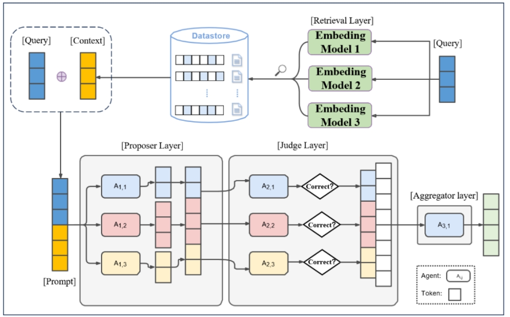

# MoA_RAG
MoA_Rag is a framework jointly proposed by **Shufan Chen** (University of Science and Technology of China) and **Runtao Ren** (City University of Hong Kong). This framework combines a mixture of agents (MoA) with Retrieval-Augmented Generation (RAG) to achieve enhanced performance in information retrieval and generation tasks.

## Folder Structure
- **dataset**: Contains raw data files, including JSONL-formatted QA pairs and index files for each dataset.
- **model**: Stores the embedding models used for retrieval.
- **results**: Stores the outputs generated by MoA_Rag as well as the corresponding evaluation metric results.
- **retrieval_results**: Stores retrieval results and evaluation metrics for each individual retriever.

## Python Files
- **MoA_Rag.py**: 
    - Supports setting the number of layers (2 or 3).
    - Allows adjusting the temperature for each layer.
    - Configures the number and type of models for each layer.
    - Sets different retrievers (embeddings) for models.
    - Customizes prompts for each layer.
- **make_index.py**: 
    - Builds the knowledge vector database for efficient retrieval.
- **retrieve.py**: 
    - Contains functions for executing the retrieval process.
    - Returns relevant chunks and their corresponding `chunks_id`.
- **evaluation.py**: 
    - Calculates 7 metrics specific to RAGAS.
- **evaluation_local.py**: 
    - Computes 4 traditional evaluation metrics.
- **eval_retrieve.py**: 
    - Evaluates retrieval performance using metrics like MRR and hit rate.
## Authors and Contributions
- **Shufan Chen** (University of Science and Technology of China): Responsible for project engineering, including code implementation and repository structure.
- **Runtao Ren** (City University of Hong Kong): Responsible for proposing the project idea, refining the framework, and drafting the associated research paper.
## Citation
If you find this framework helpful, please consider citing our paper:

```bibtex
@misc{ren2025ra-moa,
      title={Retrieval-Augmented Mixture-of-Agents (RA-MOA): Two heads are better than one}, 
      author={Runtao Ren and Shufan Chen},
      year={2025},
      conference={NAACL},
      primaryClass={cs.AI}
}

